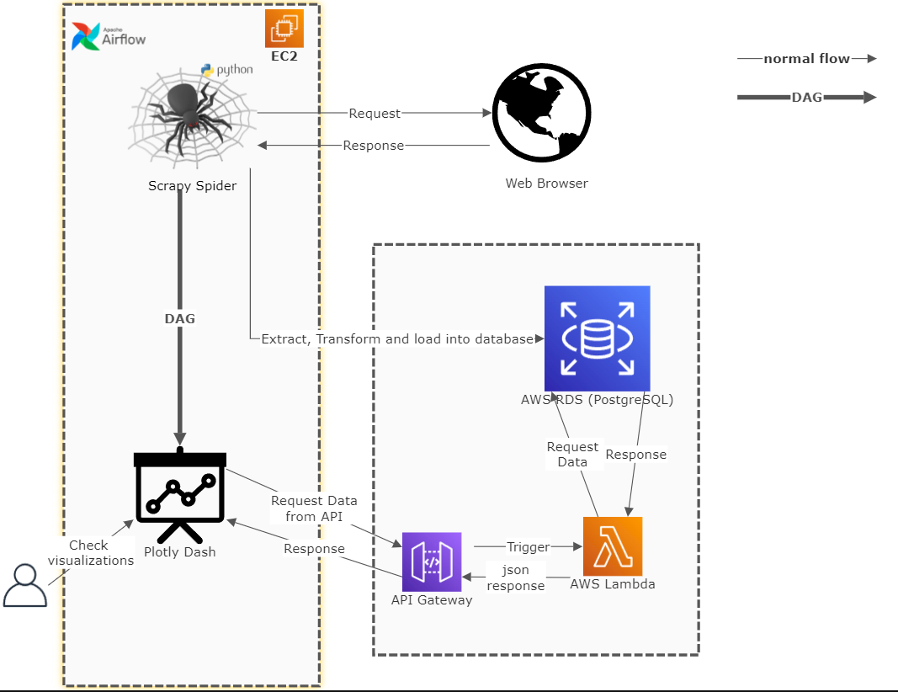

# nepalypscraper
This is a data pipelining project that scrapes data from https://www.nepalyp.com/

## Steps followed by Airflow:
1. Scrape data from https://www.nepalyp.com
2. Store the scraped data into AWS RDS PostgreSQL database.
3. Serve API using API Gateway and AWS Lambda.
4. Requeste data from the API server created using API Gateway and create visualization using Plotly in jupyter notebook.

## Framework and tools used:
1. Scrapy: To scrape data from https://www.nepalyp.com
2. PostgreSQL: To store scraped data using Scrapy.
3. Nodejs and Express.js: To create API endpoint from the data stored in the PostgreSQL database.
4. Plotly: To create visualization from the data received as a response from the API server.
5. Apache Airflow: To automate the ETL task and create visualization.

## How to run the project?

> Step1:
>
> pip install -r requirements.txt

> Step2:
>
> airflow webserver
>
> airflow scheduler

> Step3:
>
> Run scrape_DAG from the Airflow server

> Step 4:
>
> see plotly dashboard on localhost:8050
> or open **visualization.nbconvert.ipynb** to see updates on visualizations
